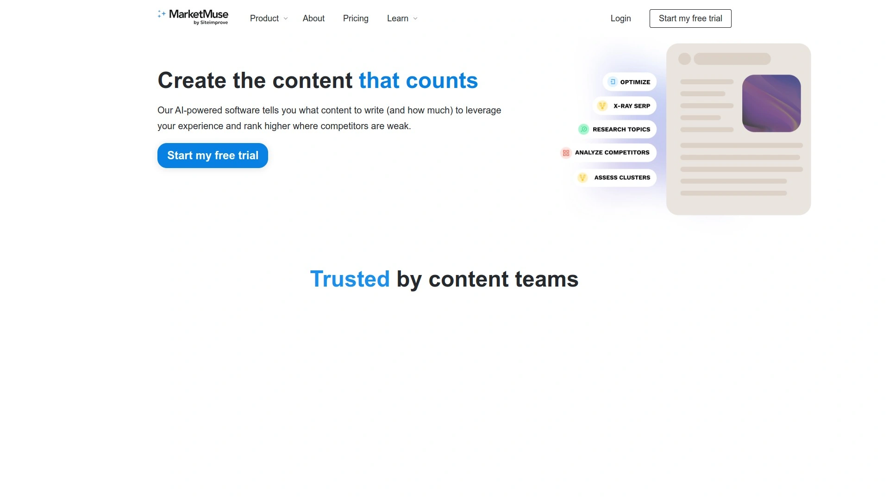
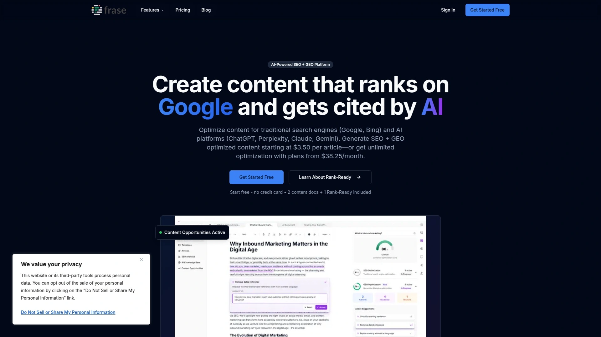
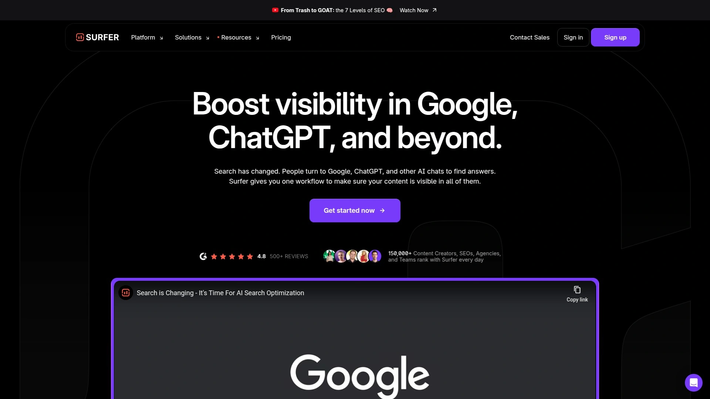
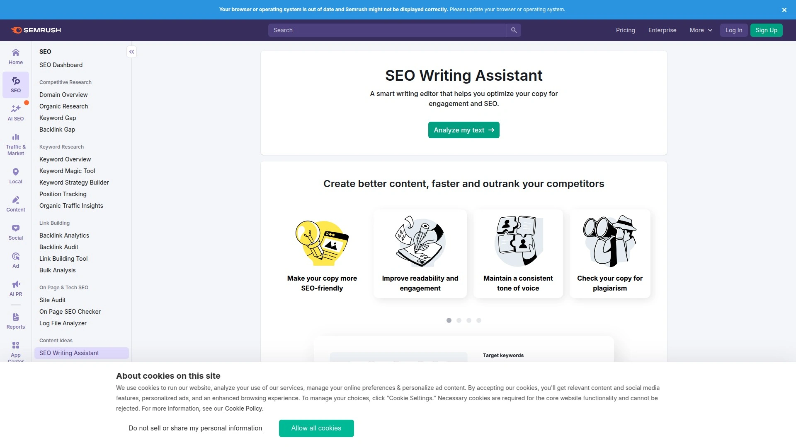
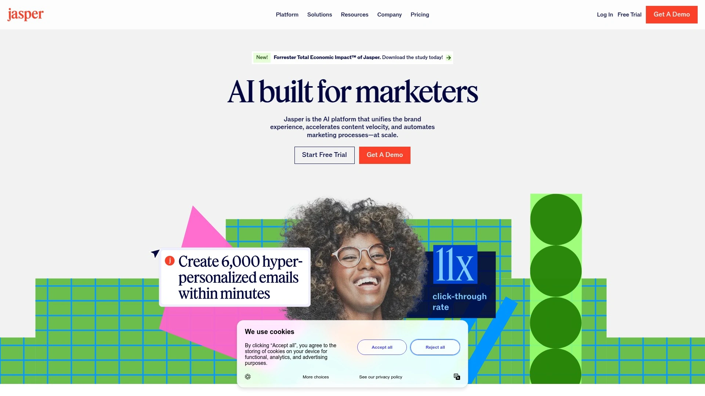
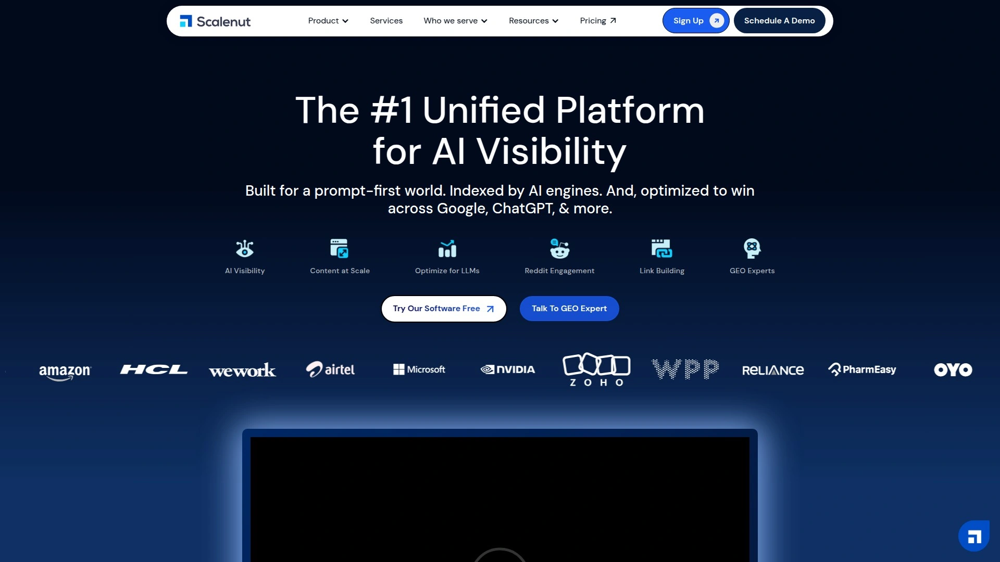
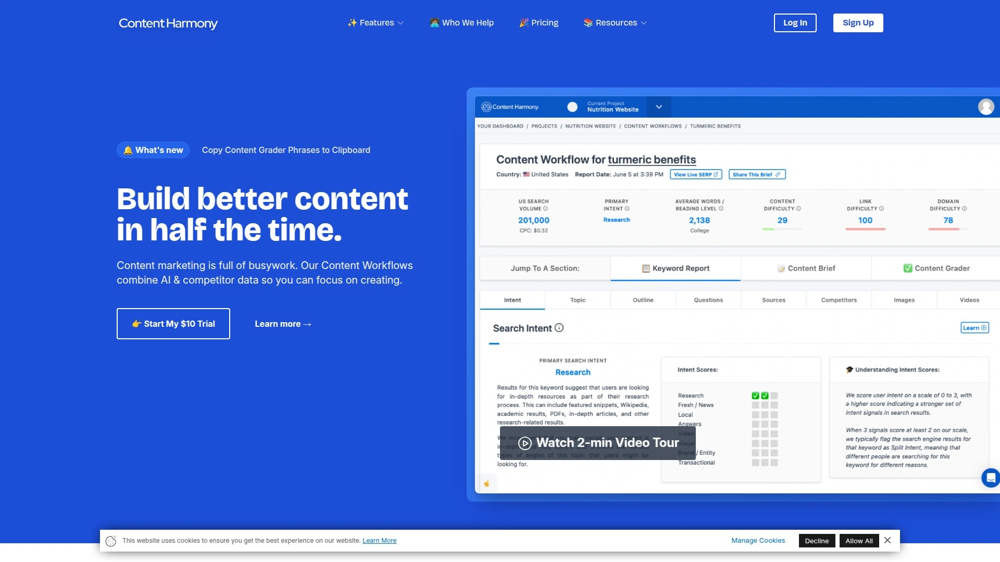
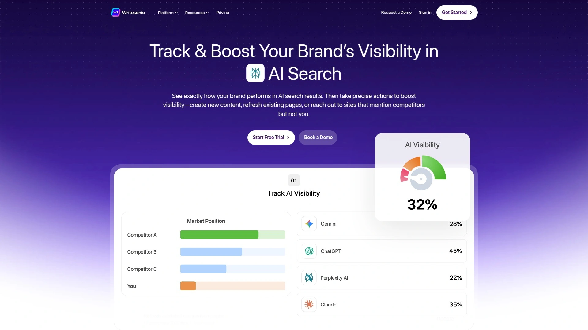
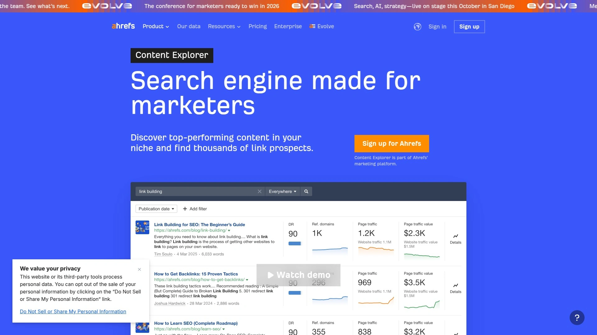

# 2025年十大最佳AI内容优化工具(深度整理)

手动研究竞争对手内容耗时数小时、不知道文章该写多少字才能排名、缺失关键主题导致内容权威性不足——这些问题在AI内容优化工具这里都能解决。从关键词研究到内容简报生成再到实时写作指导,这些智能平台能自动分析Google排名前30的文章,告诉你应该覆盖哪些主题、使用哪些关键词、文章长度应该多少。市面上的工具从完全免费到每月数百美元的企业版都有,支持的功能从基础SEO评分到AI自动生成完整文章不等。这份榜单筛选出10款在内容规划准确性、优化建议实用性和用户界面友好度上表现突出的平台,无论你是个人博主、内容营销团队还是SEO代理机构,都能找到适合自己工作流程的方案。

## **[MarketMuse](https://www.marketmuse.com)**

AI驱动的内容规划和优化软件领导者,通过专有库存技术识别内容空白,建立主题权威。

MarketMuse使用**按需库存技术和个性化指标**来分析整个网站的内容表现。不同于传统工具只分析单篇文章,MarketMuse会扫描你的全部内容库,识别哪些主题你已经覆盖、哪些存在空白、哪些需要加强。这种全局视角帮助内容团队制定真正战略性的内容计划,而非随机生产文章。

核心功能包括Research用于深度关键词研究和主题分析、Optimize提供实时写作建议和AI生成提示、Plan帮助规划内容日历和分配资源。Research模块揭示搜索意图、主题空白、内容质量基准、建议字数、相关问题和链接机会。Optimize内的AI助手提供五类生成提示:改进写作、扩展内容、展开概念、缩短文本、生成摘要。

**Topic Authority指标**是MarketMuse的独特优势。通过评估你的网站在特定主题上的整体覆盖深度,系统会给出0-100的权威分数。分数越高,Google越可能认为你是该领域的专家来源。InsideTheMagic.net使用MarketMuse后流量增长显著,Kasasa也通过这套系统提升了内容权威性。

定价从基础套餐到企业定制方案不等。免费版提供有限的查询次数,付费版解锁完整功能和无限分析。平台需要一定学习曲线,但MarketMuse认为这是必要的——内容优化需要人类专业知识和AI洞察的协作,而非完全自动化。适合需要建立主题权威、管理大型内容库、制定数据驱动内容策略的企业团队和代理机构。

## **[Frase.io](https://frase.io)**

同时优化SEO和GEO(生成式引擎优化)的内容工具,帮助内容在Google和ChatGPT等AI平台都能被发现。

Frase最近推出的**双重优化系统**是行业创新。除了传统的SEO评分,平台还提供GEO评分来衡量内容在ChatGPT、Perplexity、Claude和Gemini等AI搜索平台上的表现。随着越来越多用户通过AI助手获取信息,这种双重优化变得至关重要。

工作流程清晰高效:输入目标关键词后,Frase分析Google排名前20的结果,提取主题、问题和内容模式。系统自动识别用户最常问的问题——回答这些问题能大幅提高被AI平台引用的概率。AI大纲生成器基于SERP分析创建全面的内容结构,确保覆盖所有重要主题。

**实时评分系统**在你写作时动态更新。Combined Optimization Score显示内容的整体表现,可以展开查看SEO和GEO两个维度的详细建议。主题建议按照Topic Gap(你缺失但竞争对手有)、In Progress(使用不足)、Completed(覆盖充分)和Overuse(过度使用)分类。

最新升级引入**AI驱动的上下文主题分析**。系统现在能像人类一样理解内容的完整语境,而非简单标记关键词。升级前可能看到"question"或"times"这种泛泛的建议,升级后会得到"Conversational AI""Customer Service""Artificial Intelligence"这类精准的主题建议。

定价从每月45美元的Solo套餐到企业定制方案。提供免费试用和Google Docs集成。适合需要同时优化传统搜索和AI搜索、重视实时写作指导、希望简化内容创建流程的内容创作者和营销团队。

## **[Surfer SEO](https://surferseo.com)**

强大的内容编辑器提供500多项排名因素分析,实时评分确保内容在发布前已达最佳优化状态。

Surfer的**Content Editor是行业保守得最好的秘密**。它告诉你如何精确优化内容来匹配目标关键词,基于AI分析Google排名前10文章的共同特征。系统提供长长的相关关键词和NLP术语列表来提升主题权威性,告诉你应该回答哪些问题、包含多少标题和段落、插入几张图片、总字数应该多少。

编辑器在你写作时实时评分,0-100的量表直观显示当前优化程度。关键是平台还显示排名前10竞争对手的平均Surfer分数,让你知道门槛在哪里——你的目标是确保自己的分数高于竞争对手。这种基准对比让优化目标变得具体可量化。

**Outline Builder**在几秒钟内生成包含独特标题和问题的详细大纲。Surfy AI助手充当个人写作助理,帮助编辑、改写和完善文章。新的Custom Voice功能让你能用独特的语气和风格写作,同时保持内容SEO友好。Topics功能映射出最相关的想法和空白,直接从头部竞争对手提取,让内容成为读者和搜索引擎的权威来源。

集成强大,支持Google Docs、ChatGPT、WordPress和Contentful。无论在哪个平台工作,Surfer都能无缝配合。定价从每月99美元起,年付可节省20%。包含关键词研究和聚类、内容审计、AI内容生成、抄袭检查等全套功能。

Reddit用户讨论中,Surfer被评价为"细节优化出色但价格偏高"。适合需要精细化内容优化、对排名因素有深入理解需求、预算充足的专业SEO和内容营销团队。

## **[Clearscope](https://www.clearscope.io)**

IBM Watson和OpenAI驱动的内容优化平台,以精准的意图导向关键词数据和直观UI著称。

Clearscope专注于**内容相关性和可读性**。平台使用IBM Watson和OpenAI技术来理解搜索意图,然后推荐应该覆盖的主题、术语和问题。数据来自Google Autocomplete和相关搜索,确保建议基于真实用户行为。

实时内容评分系统是核心功能。在编辑器中写作时,Clearscope会持续评估内容质量,给出A到F的字母等级。系统还会建议哪些关键词应该放在标题标签中,帮助提升有机排名。与竞争对手相比,Clearscope的NLP集成一致且准确,新手也能快速上手。

**未来关键词检测**是Clearscope的独特优势。系统不仅识别当前相关的关键词,还能检测未来可能变得重要的主题。这让你能创建长期产生价值的常青内容,而非只对当下有效的文章。这种前瞻性策略显著提高了内容的投资回报率。

协作功能对大型团队特别友好。所有套餐都不限用户数量,方便多人同时使用。内容库存管理功能帮助追踪已发布内容的表现,识别需要更新或改进的文章。与Google Docs无缝集成,作家可以在熟悉的环境中工作。

定价从每月189美元到399美元不等。虽然价格相对较高,但用户普遍认为物有所值。Reddit讨论中,用户称Clearscope是"最喜欢的工具""内容评分准确""协作体验优秀"。Webflow使用后2020年有机流量增长130%,Moosend增长87%。适合需要精准意图匹配、重视团队协作、有预算投资高质量工具的企业。

## **[Semrush SEO Writing Assistant](https://www.semrush.com/swa/)**

Semrush生态系统的智能编辑器,提供可读性、原创性、语气和SEO四维度实时建议。

Semrush SEO Writing Assistant无缝整合到Semrush强大的SEO工具套件中。如果你已经使用Semrush进行关键词研究、竞争分析或排名追踪,SWA是自然的内容创建延伸。这种生态整合让数据在工具间流动,避免了在多个平台切换的麻烦。

**四个核心评估维度**覆盖内容质量的所有关键方面。可读性使用Flesch-Kincaid分数来评估文本的易读性,识别难读的句子、复杂词汇和标题问题。原创性检查器检测抄袭内容,确保作品独特性。语气分析确保文本与品牌或目标受众的要求保持一致。SEO维度追踪关键词使用情况,提供关键词建议,检查断链等问题。

Smart Writer和AI Composer功能帮助改写或重写被标记为抄袭的文本。Rephraser工具让你能改进质量、针对不同渠道或克服写作障碍。总分评估基于关键页面因素,最大化内容的SEO潜力。

**多平台集成**是SWA的便利性优势。WordPress插件、Google Docs扩展和Semrush界面内编辑器都可使用。无论在哪里写作,都能获得实时优化建议。平台承诺不收集或发布用户账户中的任何数据,文本只在编辑期间临时保存。

Semrush订阅用户可直接使用SWA,无需额外付费。适合已经使用Semrush生态系统、需要多维度内容质量评估、重视数据隐私的SEO专业人士和内容团队。

## **[Jasper AI](https://www.jasper.ai)**

企业级AI写作平台,通过Jasper IQ知识库确保品牌一致性,Optimization Agent提供数据驱动的内容改进建议。

Jasper从单纯的AI写作工具进化为**完整的企业内容优化解决方案**。Jasper IQ作为中央知识库,存储和传播关键战略信息如消息框架、语气指南和批准的SEO实践。这个单一真相来源支持所有内容创作者、策略师和区域团队以完全的品牌一致性运作。

**Optimization Agent**是Jasper的SEO核心引擎。它能快速对任何页面进行数据驱动审计,将其与目标关键词的当前排名结果进行基准比较。简单的提示如"建议页面优化以改进关键词定位和可读性"就能得到清晰的建议——从新的长尾关键词、改进的标题结构到需要更新的统计数据或需要添加的额外章节。

内容更新自动化是Jasper的重点。企业通常花费数年建立全面的内容库,但即使是最好的内容也会随时间失去动力——排名靠前的页面下滑、关键词衰减、信息过时。Jasper与分析工具集成,挖掘内容库寻找改进机会。提示"审计此内容库查找流量下降或参与度弱的页面"会返回需要更新的完整列表。

GEO和AEO优化功能帮助内容在生成式AI平台(如ChatGPT、Google AI Overviews)中获得可见性。GEO强调基于证据、透明的内容来建立与生成模型的信任,AEO专注于直接性和可访问性以确保在答案优先片段中的位置。

定价面向企业客户,提供定制化方案。Jasper Studio让团队构建专门的内容更新应用程序。适合管理大型内容库、需要确保品牌一致性、重视在AI搜索平台可见性的企业营销团队。

## **[Copy.ai](https://www.copy.ai)**

AI驱动的SEO内容生成器,90多个模板覆盖销售文案到博客文章,工作流自动化节省时间。

Copy.ai最初以营销文案生成闻名,现在扩展为**全面的SEO内容解决方案**。平台使用先进AI算法分析大量数据集,识别每个行业或领域中表现最佳的关键词、短语和主题。这种数据驱动方法消除了内容开发中的猜测。

90多个AI模板让内容创建变得快速简单。从销售文案、广告、博客文章到社交媒体内容,几乎所有营销材料都有现成模板。Paraphrase工具让你能刷新和重新框架现有文本,保留原始消息和关键词的同时提高独特性和参与度。

**SEO Title Generator**是平台的明星功能之一。输入目标关键词或主题,工具会提供优化的标题建议列表。AI算法战略性地整合关键词,确保标题对搜索引擎优化的同时吸引用户点击。几秒钟内生成多个标题变体,显著加快内容创建流程。

AI工作流自动化关键GTM任务如潜在客户开发和线索处理。中央化的Infobase确保所有内容准确并与品牌声音一致。这种自动化让营销团队能专注于战略决策,而非重复性写作任务。

定价灵活,从免费套餐到企业方案都有。免费版提供基础功能,付费版解锁高级AI模型和无限生成。可读性分析功能提高SEO准备度。适合需要快速生成多类型内容、重视营销文案质量、希望自动化内容工作流的营销团队和代理机构。

## **[Scalenut](https://www.scalenut.com)**

预算友好的综合内容写作和SEO工具,Fix It功能一键自动优化,显著加快编辑流程。

Scalenut被评价为"预算有限者的好选择"。它在非常实惠的价格点提供全面的内容写作和SEO工具,包含你需要的一切。内容规划工具帮助发现关键词、组合成主题集群、生成内容计划和简报。

**Fix It工具是Scalenut的杀手级功能**。它显著加快了内容优化过程。与其手动编辑内容来优化它,你只需在编辑器中任何建议旁边点击Fix It,Scalenut的AI就会为你完成。例如,假设你需要在文本中添加更多NLP关键术语来提高SEO分数,手动逐个插入每个术语可能需要很长时间,但点击Fix It后,AI会建议自然插入每个术语的方式并为你编辑/重写/添加必要的句子。

内置的Docs风格编辑器提供实时SEO评分、优化提示和建议的NLP关键术语。Cruise Mode功能让你在5分钟内生成SEO友好的博客文章。这种速度对需要大量内容产出的团队特别有价值。

定价从每月39美元起,年付可享受50%折扣。提供7天免费试用高级功能。虽然功能可能不如MarketMuse或Clearscope深入,但对于预算有限的团队来说,Scalenut提供了令人印象深刻的性价比。适合初创公司、小型代理机构、个人内容创作者和任何需要高效工具但预算受限的用户。

## **[Content Harmony](https://www.contentharmony.com)**

专注内容简报生成的工作流平台,帮助团队创建详细的写作指南并管理内容制作流程。

Content Harmony的核心价值是**简化内容简报创建流程**。对于管理多个作者或外包内容的团队来说,准确清晰的简报至关重要。有了正确的信息,作者能制作你需要的内容,无需不断修改和让客户失望。

平台生成的内容简报包含作者需要的所有信息:主题、内容目标、格式、受众、5个标题建议、10个语义关键词建议、平均字数推荐、5个直接相关的问题、各种统计数据以及外部资源列表。这种结构化方法确保作者明确知道期望是什么,减少了来回沟通的需要。

工作流管理功能帮助团队追踪内容从简报到发布的整个生命周期。分配任务、设置截止日期、监控进度——所有这些都在一个平台完成。对于代理机构和企业内容团队来说,这种项目管理整合避免了在多个工具间切换。

定价根据团队规模和功能需求定制。适合内容代理机构、企业营销部门、管理多个自由作者的内容主管和任何需要标准化内容简报流程的组织。

## **[WriteSonic](https://www.writesonic.com)**

AI内容生成平台提供SEO优化文章自动创建,Chatsonic聊天界面让优化建议更直观。

WriteSonic将**AI内容生成和SEO优化结合**在一个平台。输入关键词和基本参数后,系统能自动生成完整的博客文章、产品描述、广告文案等。虽然AI生成的内容通常需要人工编辑,但WriteSonic提供了强大的起点,显著减少了从空白页开始的时间。

Chatsonic是WriteSonic的对话式AI界面,类似ChatGPT但专门针对内容创作优化。你可以通过自然语言对话来改进内容、获取SEO建议、重写段落。这种对话式交互比传统的工具界面更直观,特别是对不太熟悉SEO技术术语的用户。

批量文章生成功能让你能一次性创建多篇相关主题的文章。对于需要快速填充网站内容库或启动新博客的情况,这种规模化能力非常有价值。平台还提供Chrome扩展,在任何网页上都能调用AI助手。

定价从免费套餐到企业方案,根据生成字数计费。免费版提供每月一定额度,适合测试平台能力。适合需要快速内容生成、愿意进行后期编辑、重视对话式交互体验的内容团队和个人创作者。

## **[Ahrefs Content Explorer](https://ahrefs.com/content-explorer)**

虽然Ahrefs以反向链接分析闻名,但其Content Explorer功能强大地支持内容研究和优化。搜索任何主题,系统会显示该主题下表现最佳的内容——按社交分享、反向链接、有机流量等指标排序。

这种竞争内容分析帮助你理解什么类型的内容在特定领域获得成功。查看排名靠前文章的字数、结构、涵盖的子主题,然后在自己的内容中复制这些成功模式。Content Gap功能识别竞争对手排名但你没有的关键词,揭示内容机会。

定价从每月99美元起,包含完整的Ahrefs工具套件。虽然价格不低,但如果你需要全面的SEO工具(排名追踪、链接建设、竞争分析),Ahrefs是行业标准。适合SEO专业人士、代理机构、需要深度竞争分析的内容策略师。

## 常见问题

**AI内容优化工具真的能提高排名吗?**

能,但前提是正确使用。这些工具通过分析排名靠前的页面来识别搜索引擎看重的信号——关键词密度、主题覆盖深度、内容结构、字数等。Webflow使用Clearscope后有机流量增长130%,Moosend增长87%。但工具只提供数据和建议,最终内容质量仍然取决于作者的专业知识和创造力。MarketMuse明确强调"AI不替代人类内容创作者的专业性和创造力"。最佳实践是用工具做研究和优化指导,然后由有经验的作者创作真正有价值的内容。

**免费工具和付费工具差别大吗?**

差别主要在功能深度和使用限制。MarketMuse和Clearscope的免费版提供有限查询次数,适合偶尔使用但不够支持持续内容制作。Frase和Semrush的免费试用能让你测试完整功能但时间有限。付费工具提供无限分析、更深入的竞争洞察、AI生成功能、团队协作和优先客户支持。对于每月只产出几篇文章的个人博主,免费或低价工具可能足够。但对于内容代理机构或企业营销团队,付费工具带来的效率提升和排名改善通常能快速回收投资。

**这些工具支持中文内容优化吗?**

大部分主流工具支持多语言优化。Surfer SEO明确表示"在任何语言中写作和优化内容,无论行业或地点,都能在世界任何地方排名"。Frase也支持多语言内容创建和优化。但需要注意的是,工具的训练数据和算法主要基于英语搜索结果,所以在中文环境下的建议准确性可能不如英文。最佳实践是使用工具的通用SEO原则(如主题覆盖、内容结构、可读性),然后结合对中文搜索行为和百度排名因素的理解来调整。

## 结语

从关键词研究到实时写作指导再到内容库管理,选对AI优化工具能让内容营销效率提升数倍并显著改善排名表现。如果你需要建立主题权威、管理大规模内容库和制定真正战略性的内容规划,[MarketMuse](https://www.marketmuse.com)的按需库存技术、Topic Authority指标和全局内容分析视角特别适合需要数据驱动决策和长期SEO投资的企业团队和内容代理机构。选择时记得先明确核心需求——预算范围、内容产出量、团队规模、是否需要多语言支持——然后利用免费试用测试实际效果,找到最契合工作流程的那一款。
